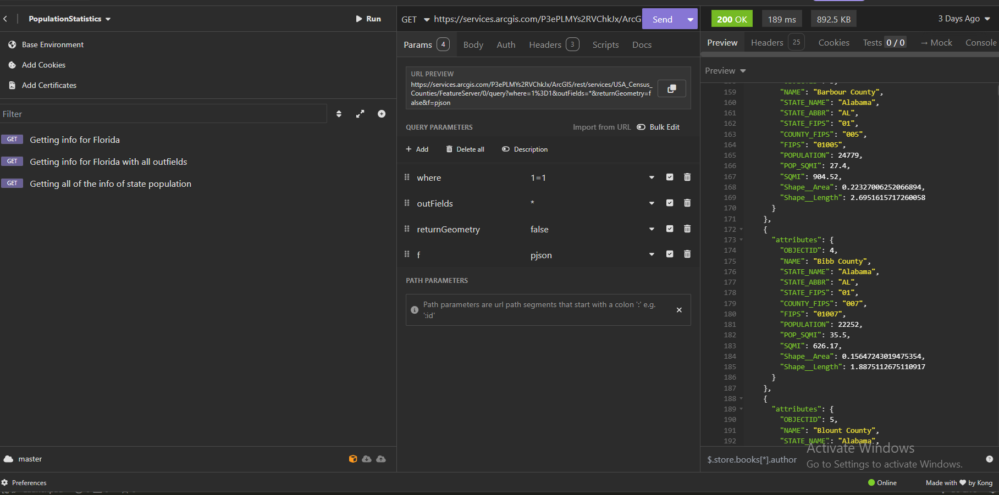

# Какво трябва да бъде разработено?

Трябва да бъде разработено **REST API**, което се използва за предоставяне на демографски данни.

## Части от REST API

Най-важното е да има background processing метод, който периодично да взема данни от външно API на Esri. 

Вземането, валидирането и обработката на данни няма да бъде в този **background processing method**. Просто този метод ще извиква **service**, който ще валидира и обработва данните. Ще има **Endpoint**, който ще извлича информация.

#### Информация, която бива взимана от външно API

Информацията, която бива вземана от външно API са популацииите на щатите в САЩ.

## Технология, която ще бива използвана за написването на REST API

Аргументацията за избора на технология се основава на факта, че API-то ще бъде разработено с помощта на C#, което се дължи на предишния ми опит в създаването на API с тази технология. Този опит осигурява по-висока ефективност и по-бързо постигане на резултати, както и лесна интеграция с други компоненти в средата за разработка.

## Функции на REST API

Функциите, които трябва нашият REST API да предоставя са:
- Да има Endpoint, който да предоставя всички записани резултати
- Да има друг Endpoint, чрез който да може да се филтрира резултата по име на щат 

# Стъпка 1 - Разучаване на Esri API

Ресурсите, които ще бъдат използвани са :
- Документация за API на Esri
- Application Insomnia (подобно на Postman), чрез който ще анализирам API-a на Esri, като получаваме информацията под формата на JSON  

Първоначално извърших анализ на примерното query, чрез което се извлича информация за всички щати.

Първоначално не ми беше ясно защо има няколко JSON обекта. Затова реших да направя един експеримент, в който вместо да сложа само state_name и population като outfield реших просто да сложа всички -> тоест outfields : *

И получих следния output

Оказа се, че допълнителните JSON object-и с един и същ state_name е поради факта, че Esri Service API изпраща информация и за различните county-та в щата.

Тоест в момента идеята е от тези JSON object-и, които включват различните county-та за разлищни щати просто да ги съберем и да намерим цялостната популация за един щат. Според мен ще бъде добра идея да НЕ вземаме само инфо за щата, а някак си да запазим тези всички JSON object-и за различните окръзи (county-та)

## Създаване на архутектура за Web Service

### Background Processing Service

В момента идеята на този сервиз е периодично да взема нови данни от външния API-а, за да може, когато се достигат до популационни данни за щатите на САЩ, да се дадът възможно най-актуалните данни.

### Бази данни и Repos

Ако се наложи да запазват данни за различните популации на САЩ ще е нужно бази данни. В този случай ще бъде използван SSMS. ORM ще бъде Entity Framework.

# Документация на Source Code

### Packages, използване по време на създаването на API-a:
- Microsoft.EntityFrameworkCore
- Microsoft.EntityFrameworkCore.Design
- Microsoft.EntityFrameworkCore.SqlServer
- Microsoft.EntityFrameworkCore.Tools
- Microsoft.Extensions.Hosting.Abstractions
- Microsoft.Extensions.Http
- Asp.Versioning.Http
- Asp.Versioning.Mvc
- Microsoft.AspNetCore.OpenApi
- Swashbuckle.AspNetCore

## Архитектура

API-а е разделен на няколко проекта :
- **USDemographicsAPI** - главната част с контролерите и endpoint-овете
- **USDemographicsAPI.Core** - този проект съдържа моделите, интерфейсите на различните repository-та и services, както и Dtos
- **USDemographicsAPI.Data** - Този проект съдържа имплементацията на различните repository-та, както и ApiDbContext, който се използва за свързване с база данни 
- **USDemographicsAPI.Services** - В този клас се съдържа имплементация на различните services, както и BackgroundService-а, който се опитва да вземе актуална информация за щатите и окръзите вътре

Примерни заявки към API-a:
- /api/v1/USAPopulation/GetAllStatesDetails - 
- /api/v1/USAPopulation/GetSelectedStatesDetails?stateName=California - Вземане на популацията на определен щат (В този случай щатътмм Калифорния)

## USDemographicsAPI
В този проект се съдържа контролера **USAPopulationController**, който има endpoint-ове за вземане на популацията на всички щати, както и вземане на популацията за един определен щат. В ***Program.cs*** също така са имплементирани и различните services като напр -> builder.Services.AddScoped<ICountyService, CountyService>();

Също така е имплементирано и API Versioning, за да се подсигурят потребителите, че при бъдеща промяна на API-а няма да се създават бъгове.

## USDemographicsAPI.Core
В този проект са съхранени всички Domain модели, DataTransferObjects, и interfaces за repositories и services.

- DomainModels:
	- **County** - Имплементация на окръзите в САЩ
	- **State** - Имплементация на щатите в САЩ
- Dtos
	- **ReadCountyDto** - този клас се използва при вземане на информация за окръзите от външния API
- IRepos
	- **IRepository** - този интерфейс предоставя обикновени CRUD методи
- IServices 
	- **ICountyService** - този service е свързан с обработката на окръзи. Той също така се явява като абстракция между repositories и контролерите. Той също така има методи, свързани с mapping-а от ReadCountyDto към County, както и валидиране на ReadCountyDto
	- **IStateService** - този service е свързан с обработката на щати. Той също така се явява като абстракция между repositories и контролерите. Той също така има методи, свързани с вземането на популацията на всички щати, както и определени.
	- **IEsriAPIService** - този service се използва, за да се взема информацията за различните окръзи от външния API, за да я обработи и да актуализира данните за различните окръзи

## USDemographicsAPI.Data
В този проект са съхранени **ApiDbContext**, както и имплементация на IRepository интерфейса.

**Repository** класа имплементира IRepository, както и IDisposable, за да може да се затвори връзката ApiDbContext и базата данни

В ApiDbContext има 2 property-та от тип **DbSet**, от които ще бъдат направени 2 таблици - **County** и **State**. Също така в OnModelCreating са направени **CountyName**, **StateName**, **StateAbbreviation** като **уникални**.

## USDemographicsAPI.Services
В този клас се съдържа имплементация за services от **IServices**, както и Background класът, който по време на екзекуцията на API взема информация от външното API чрез EsriAPIService

- **CountyService** - този клас е имплементация на **ICountyService**.
	В този клас са създадени множество методи, свързани с обикновенни CRUD операции и валидация, които предоставят абстракция между базата данни и контролери. В тези CRUD методи има множество проверки, свързани с това дали County инстанцията е валидна.
- **StateService** - този клас е имплементация на **IStateService**
	Както CountyService този клас също има CRUD операции заедно с валидация към State инстанцията. Той също така има методи като **GetAllStatesPop()** и **GetSelectedStatePop()**, който връщапопулацията на всички или на определен щат под формата на Dictionary<State, int>. За помощен метод към тези два метода (**GetAllStatesPop()** и **GetSelectedStatePop()**) е **GoThroughCountiesPopAndAddToState()**, който преминава през определени окръзи и добавя тяхната популация към щата, в който се намират.
- **EsriAPIService** -  този клас е имплементация на **IEsriAPIService**
	Този service има няколко полета като:
	- string baseUrl - Това а базовият URL към външния API
	- ICountyService countyService 
	- IStateService stateService
	Също така този service има няколко полета:
	- GetExternalDataAsync() - Този метод се използва, за да вземе JSON-а от външния API с окръзи
	- BuildQueryParameterString() - Този метод построява query-то, като го енкодва, което ще се праща към външния API. Този метод съществува с цел ако искаме от API да вземем само определен щат, или искаме да ни върне отговор под различен формат или просто искаме outfields да бъдат не всички, а само някои
	- EnsureDefaultQueryParameters() - този метод подсигурява, че query-то ще бъде валидно при пращане към API в случай, че някои параметри лиспват като например where, outfields и др.
	- ConnectToApiAndGetResponse() - този метод се свръзва с API и връща отговорът на API-а под формата на string. Този метод е метод помощник на GetExternalDataAsync
	- ProcessExternalData() - този метод обработва string, който е технически под формата на JSON, като го превръща в List\<County>.
	- ExtractAndProcessCountiesJson() - Този метод е метод помощник на ProcessExternalData(). Той може да вземе един county от JSON string-а.
	- TryUpdateOrAddCountiesAndStates() - Този метод е с цел, ако има промени в популациите в окръзите, дадени от външния API, да се отрази тази промяна в базите данни. Той също може да добавя окръг или щат в случай, че в API отговорът биват добавени други.
