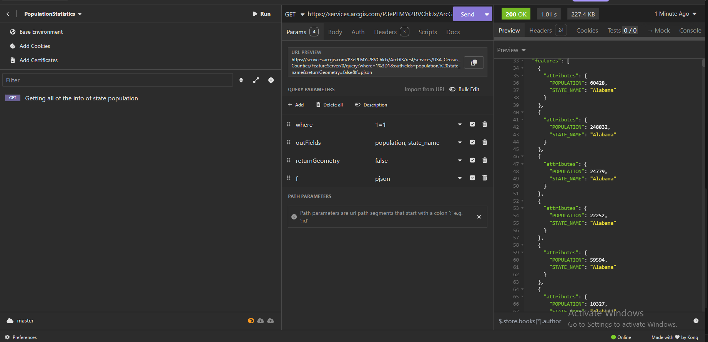

# Какво трябва да бъде разработено?

Трябва да бъде разработено **REST API**, което се използва за предоставяне на демографски данни.

## Части от REST API

Най-важното е да има background processing метод, който периодично да взема данни от външно API на Esri. 

Вземането, валидирането и обработката на данни няма да бъде в този **background processing method**. Просто този метод ще извиква **service**, който ще валидира и обработва данните. Ще има **Endpoint**, който ще извлича информация.

### Информация, която бива взимана от външно API

Информацията, която бива вземана от външно API са популацииите на щатите в САЩ.

## Технология, която ще бива използвана за написването на REST API

Аргументацията за избора на технология се основава на факта, че API-то ще бъде разработено с помощта на C#, което се дължи на предишния ми опит в създаването на API с тази технология. Този опит осигурява по-висока ефективност и по-бързо постигане на резултати, както и лесна интеграция с други компоненти в средата за разработка.

## Функции на REST API

Функциите, които трябва нашият REST API да предоставя са:
- Да има Endpoint, който да предоставя всички записани резултати
- Да има друг Endpoint, чрез който да може да се филтрира резултата по име на щат 

# Стъпка 1 - Разучаване на Esri API

Ресурсите, които ще бъдат използвани са :
- Документация за API на Esri
- Application Insomnia (подобно на Postman), чрез който ще анализирам API-a на Esri, като получаваме информацията под формата на JSON  

Първоначално извърших анализ на примерното query, чрез което се извлича информация за всички щати.

Първоначално не ми беше ясно защо има няколко JSON обекта с еднакви имена на щати. Затова реших да направя един експеримент, в който вместо да сложа само state_name и population като outfield реших просто да сложа всички -> тоест outfields : *

И получих следния output

Оказа се, че допълнителните JSON object-и с един и същ state_name е поради факта, че Esri Service API изпраща информация и за различните county-та в щата.

Тоест в момента идеята е от тези JSON object-и, които включват различните county-та за разлищни щати просто да ги съберем и да намерим цялостната популация за един щат. Според мен ще бъде добра идея да НЕ вземаме само инфо за щата, а някак си да запазим тези всички JSON object-и за различните окръзи (county-та)

